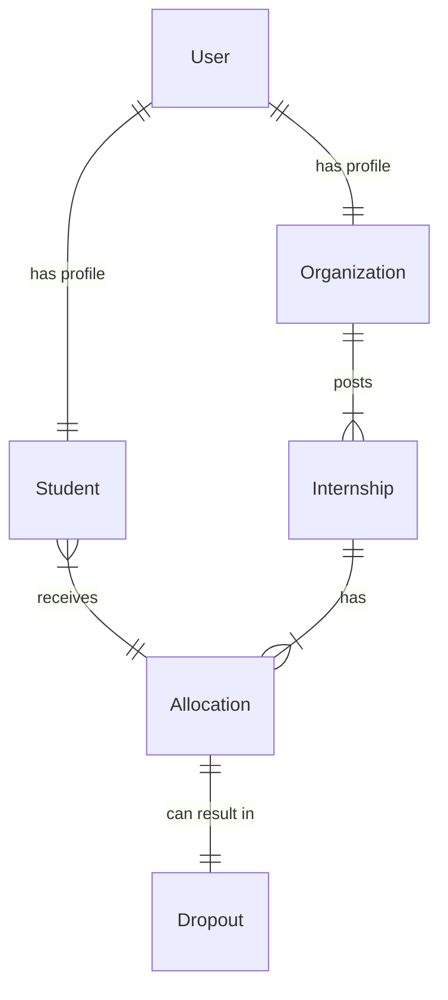

yes# MongoDB Schema Design for Internship Allocation System

This document outlines the Mongoose schemas designed to support **Blind Allocation**, **Explainable AI**, and **Dropout Management**.

## 1. User Schema (Authentication)
*Central identity management. Separates auth credentials from profile data.*

**Collection**: `users`

| Field | Type | Description | Indexing |
| :--- | :--- | :--- | :--- |
| `_id` | ObjectId | Unique Identifier | PK |
| `email` | String | Official Email | Unique, Sparse |
| `password` | String | Hashed (Bcrypt/Argon2) | - |
| `role` | String | Enum: `['STUDENT', 'ORG', 'ADMIN']` | - |
| `isVerified` | Boolean | KYC/Email Verification Status | - |
| `createdAt` | Date | - | - |

---

## 2. Student Profile Schema (Candidate)
*Contains all matching criteria. Supports 'Blind Allocation' via `blindId`.*

**Collection**: `students`

| Field | Type | Description | Indexing |
| :--- | :--- | :--- | :--- |
| `user` | ObjectId | Ref: `User` | Unique |
| `blindId` | String | Anonymized ID (e.g., hash of Aadhar/ID) | Unique |
| `personal` | Object | `{ name, gender, dob, category (Social Justice) }` | - |
| `contacts` | Object | `{ phone, address, city, state }` | - |
| `academic` | Object | `{ degree, institution, gpa, passingYear }` | `academic.gpa` |
| `skills` | Array | List of `{ name, level (1-5), isVerified }` | Multikey |
| `preferences` | Object | `{ locations: [], domains: [], minStipend }` | - |
| `availability` | Boolean | Is currently available for allocation? | Compound |
| `allocationStatus` | String | Enum: `['PENDING', 'MATCHED', 'ACCEPTED']` | Compound |

> **Blind Allocation Note**: The AI Engine uses `blindId` and `skills/academic` data ONLY. Personal identifiers (Name, Phone) are excluded from the matching dataset.

---

## 3. Organization Profile Schema
*Company/Ministry details.*

**Collection**: `organizations`

| Field | Type | Description | Indexing |
| :--- | :--- | :--- | :--- |
| `user` | ObjectId | Ref: `User` | Unique |
| `name` | String | Org Name | Text |
| `type` | String | Enum: `['MINISTRY', 'PSU', 'PRIVATE', 'NGO']` | - |
| `sector` | String | e.g., "IT", "Agriculture", "Finance" | - |
| `locations` | Array | Operational Cities | - |

---

## 4. Internship Schema (The Opportunity)
*Requirements definition used for the "Demand" side of the algorithm.*

**Collection**: `internships`

| Field | Type | Description | Indexing |
| :--- | :--- | :--- | :--- |
| `org` | ObjectId | Ref: `Organization` | - |
| `title` | String | Role Title | Text |
| `description` | String | Detailed Scope of Work | - |
| `requiredSkills` | Array | `[{ skill: String, weight: Number }]` | Multikey |
| `minGPA` | Number | Cut-off criteria | - |
| `location` | String | Work location/City | - |
| `stipend` | Number | Monthly Stipend | - |
| `vacancies` | Number | Total slots available | - |
| `filledCount` | Number | Slots currently occupied | - |
| `status` | String | Enum: `['OPEN', 'CLOSED', 'In-Progress']` | Compound |

---

## 5. Allocation Log Schema (AI Decisions)
*Stores the match result with **Explainability** vectors.*

**Collection**: `allocations`

| Field | Type | Description | Indexing |
| :--- | :--- | :--- | :--- |
| `batchId` | String | ID of the allocation run cycle | Indexed |
| `student` | ObjectId | Ref: `Student` | Compound |
| `internship` | ObjectId | Ref: `Internship` | Compound |
| `score` | Number | Final AI Match Score (0.0 - 1.0) | - |
| `breakdown` | Object | **Explainability**: `{ skillMatch: 0.8, locMatch: 1.0, gpaMatch: 0.5 }` | - |
| `status` | String | Enum: `['PROPOSED', 'ACCEPTED', 'REJECTED']` | Indexed |
| `expiresAt` | Date | Time for student to accept/reject | TTL Index |

> **Explainability Note**: The `breakdown` field explicitly stores *why* a student was matched (e.g., "80% Skill Overlap", "Preferred Location match"). This is crucial for transparency.

---

## 6. Dropout / Reallocation Log
*Tracks failures and triggers the "Reallocation" workflow.*

**Collection**: `dropouts`

| Field | Type | Description | Indexing |
| :--- | :--- | :--- | :--- |
| `student` | ObjectId | Ref: `Student` | - |
| `internship` | ObjectId | Ref: `Internship` | - |
| `allocation` | ObjectId | Ref: `Allocation` | - |
| `reason` | String | Reason for dropping out | - |
| `initiatedBy` | String | Enum: `['STUDENT', 'ORG', 'SYSTEM']` | - |
| `isReallocated`| Boolean | Has this user been re-entered into the pool? | - |
| `createdAt` | Date | Timestamp of dropout | - |

---

## Summary of Relationships

